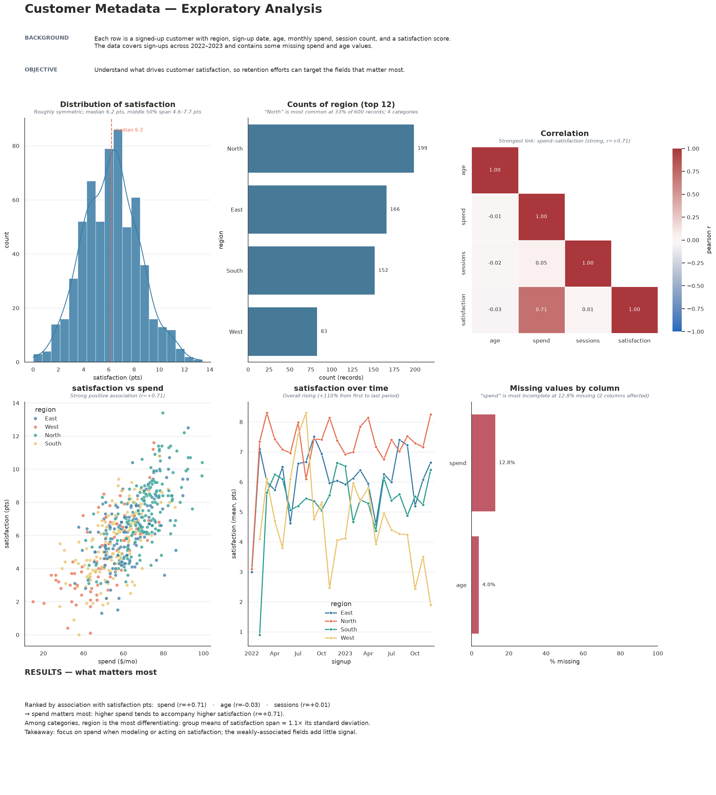
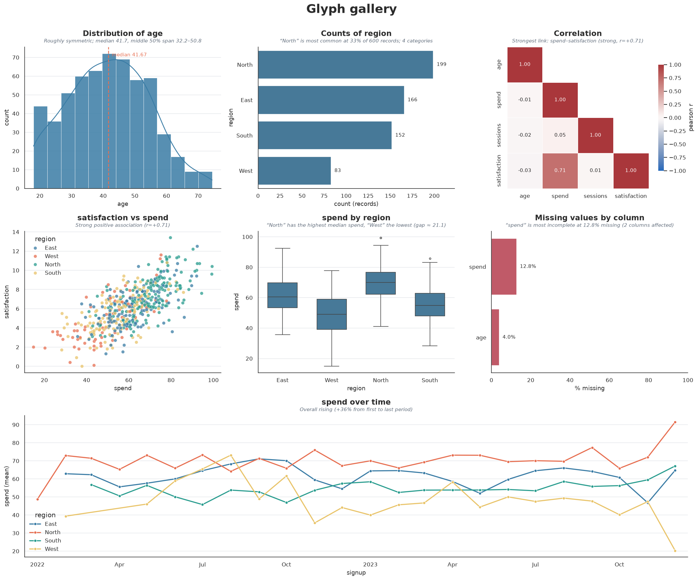

# Glyph

Meaningful, visually appealing plots for data scientists — built on
seaborn/matplotlib.

Glyph is a small set of plain functions for the plots you actually reach for
during exploratory data analysis. Each one takes a pandas DataFrame and
returns a matplotlib `Axes`, so you can keep customizing with the API you
already know. A cohesive theme is applied automatically, so plots look good
with zero setup.

```python
import pandas as pd
import glyph

df = pd.read_csv("data.csv")

glyph.distribution(df, "age")
glyph.correlation(df)
glyph.scatter(df, "spend", "satisfaction", hue="region")
```

## Built for user & content metadata

Glyph covers the questions you ask of metadata, each with a readable,
comparison-friendly plot:

| Question | Function(s) |
|---|---|
| Understanding a single **categorical** field | `counts` |
| Understanding a **numeric** field | `distribution`, `boxplot` |
| **Relationships** between fields | `scatter`, `correlation`, `pairplot` |
| **Temporal** metadata (trends over time) | `timeseries` |

## One-page report

`glyph.report(df, ...)` composes a full narrative on a single figure: a
**header** with your background and objective, a grid of the most informative
graphs — each with a one-line *discovery subtitle* and units on its axes — and
a **results** section that ranks which fields matter most for your target.

```python
glyph.report(
    df,
    title="Customer Metadata — Exploratory Analysis",
    context="Each row is a signed-up customer with region, sign-up date, age, "
            "monthly spend, sessions, and a satisfaction score.",
    objective="Understand what drives satisfaction, to focus retention efforts.",
    target="satisfaction",
    units={"age": "years", "spend": "$/mo", "satisfaction": "pts"},
    path="report.png",
)
```



## Install

```bash
pip install -e .
```

Dependencies: **pandas**, **matplotlib**, **seaborn**.

## Functions

Every function returns a matplotlib `Axes` (except `pairplot`, which returns a
seaborn `PairGrid`). Pass `ax=` to draw into your own subplot.

| Function | What it shows |
|---|---|
| `distribution(df, column, hue=None)` | Histogram + KDE, with a median line |
| `counts(df, column, top=None)`       | Ordered, labelled bar chart of category frequencies |
| `correlation(df, method="pearson")`  | Annotated correlation heatmap (upper triangle masked) |
| `scatter(df, x, y, hue=None, size=None)` | Relationship between two numeric columns |
| `boxplot(df, x, y, hue=None)`         | A numeric distribution compared across categories |
| `timeseries(df, time, value=None, freq="MS", agg="mean", hue=None)` | A metric (or record count) over time, resampled; `hue` compares groups |
| `missing(df)`                         | % missing per column, worst first |
| `pairplot(df, hue=None, columns=None)`| Grid of pairwise relationships (corner layout) |
| `report(df, target=None, context=..., objective=..., units=..., path=None)` | A one-page narrative report (header → graphs → results) |

### Findings and units

Every single-axes plot takes two extra options:

- `units={"age": "years", "spend": "$"}` — appends units to axis labels (and to
  findings), e.g. `spend ($)`.
- `describe=True` (default) — draws a one-line *discovery subtitle* summarizing
  the key finding (median and spread, strongest correlation, trend direction,
  …). Set `describe=False` to omit it.

### Example

```python
import pandas as pd, glyph

df = pd.DataFrame({
    "region": ["N", "S", "N", "E", "S", "N"],
    "spend":  [70, 55, 82, 60, 48, 75],
    "score":  [8.1, 5.5, 9.0, 6.2, 4.8, 7.7],
})

ax = glyph.boxplot(df, "region", "spend")
ax.set_ylabel("monthly spend ($)")   # it's just a matplotlib Axes
ax.figure.savefig("spend_by_region.png")
```

## Theme

The Glyph look — a modern palette, light gridlines, clean spines, confident
titles — is applied on import. Reapply or adjust it with `set_theme`:

```python
glyph.set_theme(context="talk")   # larger fonts for slides
glyph.set_theme(grid=False)       # drop the gridlines
glyph.PALETTE                     # the qualitative color list
glyph.color(2)                    # one palette color by index
```

## Gallery

```bash
python examples/gallery.py   # writes glyph_gallery.png
```



## Development

```bash
pip install -e ".[dev]"
pytest
```

## Project layout

```
GlyphLibrary/
├── src/
│   └── glyph/
│       ├── __init__.py
│       ├── theme.py      # the Glyph look
│       ├── plots.py      # the plotting functions
│       ├── insights.py   # data → one-line findings + driver ranking
│       └── report.py     # the one-page narrative report
├── examples/
│   ├── gallery.py        # renders glyph_gallery.png
│   └── report_example.py # renders glyph_report.png
├── tests/
├── README.md
├── pyproject.toml
└── LICENSE
```
